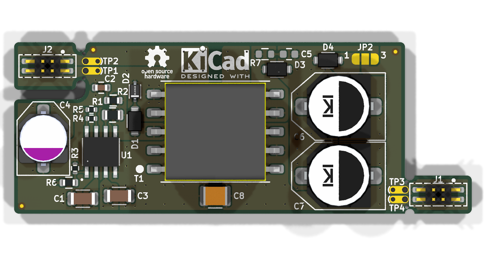
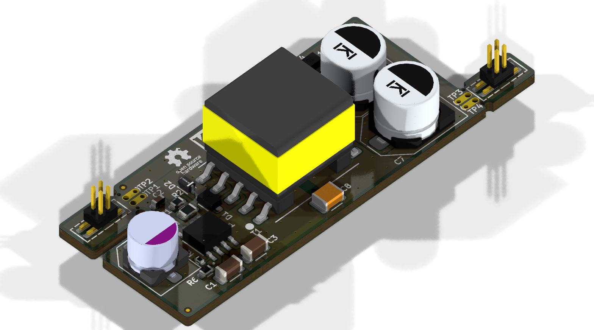

# Minimal_LT8304

## Overview

This repository contains a minimal KiCad design project for the Analog Devices LT8304, a monolithic micropower isolated flyback converter. The project includes schematic designs and PCB layout files for implementing this versatile isolated power supply IC.

## Disclaimer

> [!NOTE]
> This project is provided "as is" and without any warranty, express or implied. For more details, please see the [LICENSE](LICENSE) file.

## About the LT8304

The LT8304 from Analog Devices is a monolithic micropower isolated flyback converter. It samples the isolated output voltage directly from the primary-side flyback waveform, eliminating the need for a third winding or an opto-isolator for regulation.

Key features include:

- **Input Voltage Range:** 3V to 100V.
- **Power Switch:** An internal 2A, 150V DMOS power switch is integrated.
- **Quiescent Current:** It has a low quiescent current of 116μA in sleep mode and 390μA in active mode.
- **Operation Modes:** It utilizes quasi-resonant boundary mode operation at heavy loads and low ripple Burst Mode® operation at light loads.
- **Package:** It is available in a thermally enhanced 8-lead SO package.
- **Power Delivery:** Can deliver up to 24W of isolated output power.
- **Output Voltage Setting:** The output voltage is set using two external resistors, with an option for a third resistor for temperature compensation.
- **Communication:** Uses a Serial Peripheral Interface (SPI) for configuration and data transfer.
- **Operating Temperature Range:** -40°C to +125°C.

## Project Structure

```
minimal_lt8304/
├── minimal_lt8304.kicad_sch       # Main schematic file
├── minimal_lt8304.kicad_pcb       # PCB layout file
├── minimal_lt8304.kicad_pro       # Project configuration file
├── fp-lib-table                     # Footprint library table
├── sym-lib-table                    # Symbol library table
├── project_jobs_set.kicad_jobset    # Project job settings
├── ibom.config.ini                  # Interactive BOM configuration
├── docs/                            # Documentation files
│   ├── pictures/                    # Images and photos
│   ├── schematics/                  # Schematic PDF exports
│   └── 3d_models/                   # 3D model files
└── KiCAD_Symbols_Generator/         # Submodule for symbol generation from CSV data
```

## Project Features

This design provides a minimal implementation of the LT8304 with the following features:

- **Power Supply:**
  - Wide input voltage range from 3V to 100V.
- **Channel Configuration:**
  - Isolated flyback converter configuration.
- **Bill of Materials (BOM):**
  - Interactive HTML BOM (`ibom.html`) for easy component identification and sourcing.
- **Libraries:**
  - Comprehensive symbol and footprint libraries integrated as a submodule.
- **3D Model:**
  - Includes a 3D model of the board for better visualization.

## Getting Started

### Prerequisites

- [KiCad EDA](https://www.kicad.org/) version 9.0 or later installed on your system
- Git (for cloning the repository and submodule management)

### Opening the Project

1. **Clone the repository** (including submodules):
   ```bash
   git clone --recursive https://github.com/ionutms/Minimal_LT8304.git
   ```
   
   If you've already cloned the repository without submodules, initialize them with:
   ```bash
   git submodule init
   git submodule update
   ```

2. **Open the project in KiCad**:
   - Launch KiCad
   - Click "Open Existing Project"
   - Navigate to the cloned repository folder
   - Select the `minimal_lt8304.kicad_pro` file

3. **Explore the design**:
   - Open the schematic editor to view the circuit design
   - Open the PCB editor to view the board layout
   - Review the symbol and footprint libraries used in the design

### Project Files

- **Main schematic**: `minimal_lt8304.kicad_sch` - Contains the primary circuit design with the LT8304 and support components
- **PCB layout**: `minimal_lt8304.kicad_pcb` - Physical board design file with proper component placement
- **Project configuration**: `minimal_lt8304.kicad_pro` - KiCad project settings

## Dependencies

This project has the following dependencies:

### 1. KiCAD Symbols Generator

This repository uses [KiCAD_Symbols_Generator](https://github.com/ionutms/KiCAD_Symbols_Generator) as a submodule for custom symbol generation.

To initialize the submodule after cloning this repository:

```bash
git submodule update --init --recursive
```

### 2. 3D Models

This project requires the [3D_Models_Vault](https://github.com/ionutms/3D_Models_Vault) repository for 3D models.

#### Setup for KiCAD 9:

1. Clone the 3D models repository:
   ```bash
   git clone https://github.com/ionutms/3D_Models_Vault.git
   ```

2. In KiCAD 9, add an environment variable:
   - Variable name: `KICAD9_3D_MODELS_VAULT`
   - Variable value: Full path to where you cloned the 3D_Models_Vault repository

## Usage

After setting up the dependencies, open the project in KiCad 9 to access all features including the 3D models.

## Symbol Generator Submodule

This project includes the KiCAD_Symbols_Generator as a submodule, which provides tools for generating KiCad symbols from CSV data files. For more information on using this tool, see the [KiCAD_Symbols_Generator documentation](minimal_lt8304/KiCAD_Symbols_Generator/README.md).

## Documentation

The `docs` folder contains:
- Schematic PDF exports
- Images and photos of the design
- 3D model files (GLB and WRL formats)

## Visuals

The following images showcase the PCB design from different perspectives:


*Top View of the PCB*


*Side View of the PCB*


*Bottom View of the PCB*

## License

This project is licensed under the MIT License - see the [LICENSE](LICENSE) file for details.

## References

- [LT8304 Datasheet](https://www.analog.com/media/en/technical-documentation/data-sheets/lt8304-8304-1.pdf)
- [KiCad EDA](https://www.kicad.org/)
